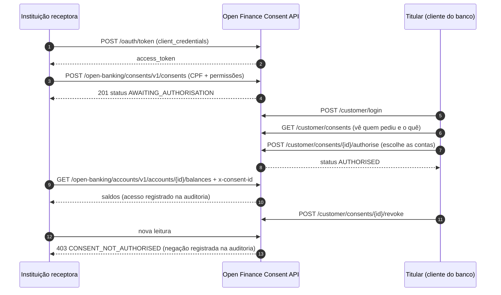

# Open Finance Consent API

[](https://github.com/PedroHMour/open-finance-consent-api/actions/workflows/ci.yml)

API em **TypeScript + Node.js** que implementa o ciclo de vida de **consentimentos** e o **compartilhamento de dados de contas**, inspirada no modelo do **Open Finance Brasil**: uma instituição receptora pede acesso, o titular autoriza escolhendo as contas, e só então os dados são liberados. Tudo é auditado.

> Projeto de estudo e portfólio. Segue as convenções do Open Finance Brasil (envelope `data/links/meta`, status de consentimento, permissões, `x-fapi-interaction-id`), mas **não é uma implementação certificada**. As simplificações estão listadas [abaixo](#simplificações-em-relação-ao-open-finance-real).

## Stack

| Camada       | Tecnologia                                                             |
| ------------ | ---------------------------------------------------------------------- |
| Linguagem    | TypeScript (strict) em Node.js 24, ESM                                 |
| HTTP         | Express 5                                                              |
| Validação    | Zod (entrada da API e variáveis de ambiente)                           |
| Banco        | PostgreSQL 16 + Drizzle ORM, com migrations versionadas em `drizzle/`  |
| Autenticação | OAuth 2.0 `client_credentials` (receptora) e login do titular, com JWT |
| Testes       | Vitest + Supertest, **integração contra Postgres real**                |
| Qualidade    | ESLint, Prettier, GitHub Actions                                       |
| Documentação | OpenAPI 3.1 (`docs/openapi.yaml`) servida com Swagger UI               |
| Infra        | Docker multi-stage + Docker Compose                                    |

## Fluxo



**Estados do consentimento**

```
AWAITING_AUTHORISATION ──autoriza──▶ AUTHORISED
        │                                │
        │ rejeita / receptora revoga     │ titular revoga / receptora revoga
        │ / 60 min sem autorização       │ / data de expiração
        ▼                                ▼
                     REJECTED  (final, com rejectedBy + motivo)
```

Motivos de rejeição: `CUSTOMER_MANUALLY_REJECTED`, `CUSTOMER_MANUALLY_REVOKED`, `CONSENT_EXPIRED` (não foi autorizado a tempo), `CONSENT_MAX_DATE_REACHED` (autorizado e chegou à data final) e `CLIENT_REVOKED` (código próprio deste projeto para revogação pela receptora).

## Como rodar

Pré-requisito: [Docker Desktop](https://www.docker.com/products/docker-desktop/).

```bash
# 1. Variáveis de ambiente
cp .env.example .env          # no Windows (cmd): copy .env.example .env

# 2. Sobe PostgreSQL + API (as migrations rodam automaticamente)
docker compose up -d --build

# 3. Dados de demonstração
docker compose exec api npm run db:seed:prod
```

| Recurso            | Endereço                        |
| ------------------ | ------------------------------- |
| Swagger UI         | http://localhost:3000/docs      |
| Health check       | http://localhost:3000/health    |
| Especificação JSON | http://localhost:3000/docs.json |

Credenciais criadas pelo seed:

| Quem                  | Credencial                                                           |
| --------------------- | -------------------------------------------------------------------- |
| Instituição receptora | `client_id=fintech-exemplo` / `client_secret=fintech-exemplo-secret` |
| Titular               | CPF `52998224725` / senha `Senha@123`                                |

> O `.env.example` traz um `JWT_SECRET` de demonstração, e a API avisa no log quando ele está em uso. Para qualquer uso fora da sua máquina, gere um próprio:
> `node -e "console.log(require('crypto').randomBytes(48).toString('hex'))"`

### Rodando sem Docker para a API (desenvolvimento)

O compose expõe o Postgres só em `127.0.0.1:5433`, para não conflitar com um Postgres já instalado na máquina (a porta muda com `DB_HOST_PORT`).

```bash
docker compose up -d db       # só o banco
npm install
npm run db:migrate
npm run db:seed
npm run dev                   # recarrega ao salvar
```

## Testando o fluxo pelo Swagger

1. `POST /oauth/token` com as credenciais da receptora → copie o `access_token`.
2. Clique em **Authorize**, cole em `clientToken`.
3. `POST /open-banking/consents/v1/consents` com qualquer `x-idempotency-key` → guarde o `consentId`.
4. `POST /customer/login` com o CPF e a senha do titular → cole o `accessToken` em `customerToken`.
5. `GET /customer/accounts` → escolha um `accountId`.
6. `POST /customer/consents/{consentId}/authorise` com `{ "accountIds": ["<accountId>"] }`.
7. `GET /open-banking/accounts/v1/accounts/{accountId}/balances` com `x-consent-id: <consentId>`.

Tente também: ler uma conta que não foi compartilhada, revogar e ler de novo, ou repetir a criação com a mesma `x-idempotency-key`.

## Testes

```bash
docker compose up -d db
npm test                 # unitários + integração
npm run test:coverage    # com relatório de cobertura
```

Os testes de integração sobem a aplicação e rodam contra um **PostgreSQL real** (banco `openfinance_test`, recriado a cada execução a partir das migrations). Eles cobrem, entre outros:

- o fluxo completo: criar, autorizar, ler dados e revogar;
- isolamento: uma receptora não vê consentimento de outra, e um titular não vê nem autoriza consentimento de outro CPF;
- negações: conta fora do consentimento, permissão não concedida, consentimento vencido ou revogado;
- idempotência, **incluindo requisições simultâneas** com a mesma chave;
- expiração por prazo de autorização e por data máxima;
- auditoria de acessos concedidos e negados, com o `x-fapi-interaction-id`.

O CI roda lint, verificação de tipos, build, testes com Postgres e, por fim, **constrói a imagem Docker e testa o health check**.

## Decisões técnicas

- **Dinheiro em centavos (inteiro)** no banco e como string com 2 casas na API (`"1500.75"`). Ponto flutuante perde precisão.
- **Idempotência transacional.** A criação de consentimento exige `x-idempotency-key`. No Open Finance esse header é obrigatório nas APIs de pagamento; aqui ele foi adotado também na criação de consentimento, por decisão do projeto. A chave é gravada na mesma transação do consentimento, com chave primária `(receptora, chave)`. Requisições simultâneas esperam a primeira e recebem a mesma resposta. Mesma chave com corpo diferente dá `422`.
- **Máquina de estados pura** (`consent-rules.ts`), sem banco nem HTTP, testada isoladamente. As transições rodam com `SELECT ... FOR UPDATE` para evitar duas mudanças simultâneas no mesmo consentimento.
- **Expiração preguiçosa.** O vencimento é aplicado e auditado sempre que o consentimento é lido ou alguém tenta alterá-lo, inclusive quando a alteração é recusada. Não depende de job agendado para ser correto.
- **Não revelar o que não é seu.** Consentimento de outra receptora responde `404`, não `403`. Conta fora do consentimento responde `403` sem consultar o banco.
- **Auditoria de negações**, não só de sucessos. Em compartilhamento de dados, a tentativa negada é tão importante quanto o acesso.
- **Nenhum dado pessoal no token.** O JWT carrega só o identificador (`sub`). A cada requisição o titular é carregado do banco, então um token de alguém removido deixa de valer e o CPF usado nas regras vem do cadastro.
- **Login resistente a enumeração e força bruta.** CPF inexistente e senha errada levam o mesmo tempo e dão a mesma resposta. O limite de tentativas é contado por CPF, então pessoas atrás do mesmo IP não se bloqueiam.
- **JWT com algoritmo fixo** (`HS256`) e emissor validado, o que impede ataques de troca de algoritmo.
- **Erros do `/oauth/token` no formato da RFC 6749** (`invalid_client`, `unsupported_grant_type`). Os demais erros usam o envelope `{ errors, meta }`.
- **Configuração validada na inicialização.** Sem `DATABASE_URL` ou com `JWT_SECRET` curto, a API nem sobe.
- **Container sem root**, imagem final sem dependências de desenvolvimento e desligamento gracioso ao receber `SIGTERM`.

## Simplificações em relação ao Open Finance real

| No Open Finance Brasil                                                                      | Neste projeto                                                                                   |
| ------------------------------------------------------------------------------------------- | ----------------------------------------------------------------------------------------------- |
| Segurança FAPI com mTLS e tokens vinculados a certificado                                   | JWT HS256 simples                                                                               |
| Consentimento vinculado ao access token via fluxo _authorization code_ com redirecionamento | Consentimento informado no header `x-consent-id`                                                |
| Diretório central de participantes                                                          | Receptoras cadastradas direto no banco                                                          |
| Especificação oficial completa de contas e consentimentos                                   | Subconjunto dos campos. Alguns nomes são próprios (`counterpartyName`, código `CLIENT_REVOKED`) |
| Versões de rota definidas pela especificação vigente de cada API                            | Rotas versionadas como `v1` pelo próprio projeto                                                |
| Regras de data e fuso definidas pela especificação                                          | Filtros de data interpretados em UTC                                                            |

## Estrutura

```
src/
  config/          validação das variáveis de ambiente
  db/              schema, cliente, migrate e seed
  modules/
    auth/          OAuth client_credentials, login do titular, JWT
    consents/      regras (máquina de estados), serviço, guard de consentimento, rotas
    accounts/      contas, saldos, transações e recursos
  shared/          erros, envelope HTTP, auditoria, middlewares, utilitários (CPF, dinheiro)
drizzle/           migrations SQL geradas a partir do schema
docs/openapi.yaml  contrato da API
tests/
  unit/            regras puras
  integration/     API + Postgres real
```

## Scripts

| Comando               | O que faz                                 |
| --------------------- | ----------------------------------------- |
| `npm run dev`         | API com recarregamento automático         |
| `npm run build`       | Compila para `dist/`                      |
| `npm test`            | Todos os testes                           |
| `npm run lint`        | ESLint                                    |
| `npm run typecheck`   | Verificação de tipos                      |
| `npm run db:generate` | Gera nova migration após alterar o schema |
| `npm run db:migrate`  | Aplica migrations                         |
| `npm run db:seed`     | Dados de demonstração (idempotente)       |

## Próximos passos

- Fluxo _authorization code_ com PKCE, vinculando o consentimento ao token.
- Job periódico para expirar consentimentos em lote, além da expiração na leitura.
- Endpoint de consulta à trilha de auditoria para o titular.
- Métricas (Prometheus) e tracing (OpenTelemetry) usando o `x-fapi-interaction-id`.

## Licença

MIT
